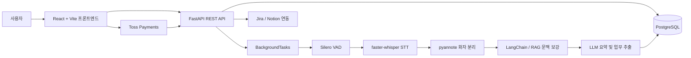

# TIKI

> 회의 파일을 업로드하면 음성을 분석하여 회의록과 업무 항목을 생성하고,
> 생성된 업무를 Jira·Notion과 연동할 수 있는 AI 기반 회의 관리 플랫폼입니다.

TIKI는 회의 음성 전사, 화자 분리, 회의 내용 요약, 업무 추출, 외부 협업 도구 연동까지 하나의 흐름으로 제공하는 협업 서비스입니다.

프론트엔드는 React와 Vite, 백엔드는 FastAPI와 PostgreSQL을 기반으로 구성했으며, AI 분석 작업은 백그라운드에서 처리됩니다.

## 프로젝트 정보

| 구분      | 내용                                                    |
| ------- | ----------------------------------------------------- |
| 프로젝트 유형 | 팀 프로젝트                                                |
| 개발 기간   | 약 5주                                                  |
| 주요 기술   | React, FastAPI, PostgreSQL, faster-whisper, LangChain |
| 주요 기능   | 회의 분석, AI 회의록 생성, 업무 추출, Jira·Notion 연동, 구독 결제        |
| 성과      | SMU 엔지니어 과정 최우수상                                      |

## 배포 및 데모

* 서비스 데모: https://tiki-eta.vercel.app/onboarding

### 데모 확인 방법

1. 배포 주소에 접속합니다.
2. 로그인 화면에서 `데모 계정 정보 자동입력` 버튼을 클릭합니다.
3. 자동으로 입력된 계정 정보로 로그인합니다.
4. 프로젝트, 회의 상세, AI 분석 결과, 업무 항목 등의 기능을 확인할 수 있습니다.

`데모 계정 정보 자동입력` 버튼은 계정 정보만 입력하며, 자동 로그인까지 진행하지는 않습니다.

## 주요 기능

### 회의 파일 분석

* 회의 음성 및 문서 파일 업로드
* Silero VAD를 활용한 음성 구간 감지
* faster-whisper 기반 음성 전사
* pyannote.audio 기반 화자 분리
* 전사 결과 후처리 및 회의 내용 구조화

### AI 회의록 생성

* 전체 회의 내용 요약
* 주요 결정 사항 추출
* 업무 항목(Action Items) 자동 생성
* LangChain과 RAG를 활용한 회의 문맥 보강
* OpenAI 기반 분석 및 Groq 대체 처리

### 프로젝트 및 회의 관리

* 회원가입 및 로그인
* 프로젝트 생성 및 관리
* 프로젝트별 회의 목록 조회
* 회의 상세 내용과 분석 결과 확인
* 생성된 업무 항목 관리

### 외부 서비스 연동

* Jira 업무 생성 및 연동
* Notion 페이지 및 데이터베이스 연동
* Toss Payments 기반 구독 결제 흐름

## 시스템 구성



### 분석 흐름

1. 사용자가 프론트엔드에서 회의 파일을 업로드합니다.
2. FastAPI 백엔드가 파일과 회의 정보를 저장합니다.
3. 백그라운드 분석 작업이 음성 구간 감지, 전사, 화자 분리를 수행합니다.
4. LLM이 회의 요약, 결정 사항, 업무 항목을 생성합니다.
5. 분석 결과를 PostgreSQL에 저장합니다.
6. 사용자는 프론트엔드에서 결과를 확인하고 Jira 또는 Notion으로 업무를 전송할 수 있습니다.

## 기술 스택

### Frontend

* React
* React Router
* Vite
* Tailwind CSS

### Backend

* FastAPI
* SQLAlchemy
* Alembic
* PostgreSQL
* FastAPI BackgroundTasks

### AI 및 음성 처리

* faster-whisper
* Whisper
* pyannote.audio
* Silero VAD
* OpenAI API
* Groq API
* LangChain
* RAG

### 외부 연동

* Jira
* Notion
* Toss Payments

### 개발 및 운영

* ffmpeg
* Python unittest
* ESLint

## 레포지토리 구조

```text
TIKI/
├─ frontend/                 # React + Vite 프론트엔드
├─ backend/                  # FastAPI 백엔드
│  ├─ app/                   # API, 서비스, 모델 및 AI 처리
│  ├─ alembic/               # 데이터베이스 마이그레이션
│  ├─ tests/                 # 백엔드 테스트
│  └─ requirements.txt
├─ scripts/                  # 로컬 실행 보조 스크립트
├─ PROJECT_FEATURES.md       # 프로젝트 기능 설명
└─ README.md
```

## 실행 환경

로컬 실행을 위해 다음 환경을 권장합니다.

* Node.js 20 이상
* Python 3.11 이상
* PostgreSQL
* ffmpeg

외부 서비스와 연결된 기능을 사용하려면 다음 인증 정보가 필요합니다.

* OpenAI API Key
* Hugging Face Token
* Jira 인증 정보
* Notion 인증 정보
* Toss Payments 인증 정보

## 환경 변수 설정

백엔드는 `backend/.env`, 프론트엔드는 `frontend/.env` 파일을 사용합니다.

실제 인증 정보는 Git에 커밋하지 않고, `.env.example`에는 필요한 환경 변수 이름만 작성합니다.

### Backend

```env
DATABASE_URL=
AUTH_SECRET_KEY=
BACKEND_CORS_ORIGINS=
FRONTEND_BASE_URL=

OPENAI_API_KEY=
HF_TOKEN=

JIRA_CLIENT_ID=
JIRA_CLIENT_SECRET=

NOTION_CLIENT_ID=
NOTION_CLIENT_SECRET=

TOSS_CLIENT_KEY=
TOSS_SECRET_KEY=

INTEGRATION_TOKEN_ENCRYPTION_KEY=
```

### Frontend

```env
VITE_API_BASE_URL=
```

## 로컬 실행 방법

### 1. 백엔드 실행

```bash
cd backend

python3 -m venv .venv
source .venv/bin/activate

pip install -r requirements.txt
alembic upgrade head

uvicorn app.main:app \
  --host 127.0.0.1 \
  --port 8013 \
  --reload
```

Windows PowerShell에서는 다음 명령으로 가상 환경을 활성화합니다.

```powershell
.venv\Scripts\Activate.ps1
```

### 2. 프론트엔드 실행

새 터미널에서 실행합니다.

```bash
cd frontend
npm install
npm run dev -- --host 127.0.0.1 --port 5173
```

### 3. Windows 통합 실행

```powershell
powershell -ExecutionPolicy Bypass -File scripts/start-local-dev.ps1
```

## 로컬 접속 주소

| 서비스                   | 주소                                       |
| --------------------- | ---------------------------------------- |
| Frontend              | `http://127.0.0.1:5173`                  |
| Backend API           | `http://127.0.0.1:8013`                  |
| Swagger API 문서        | `http://127.0.0.1:8013/docs`             |
| Health Check          | `http://127.0.0.1:8013/api/v1/health`    |
| Database Health Check | `http://127.0.0.1:8013/api/v1/health/db` |

## 주요 API

### 인증

```http
POST /api/v1/auth/signup
POST /api/v1/auth/login
GET  /api/v1/auth/me
```

### 파일 및 회의 분석

```http
POST /api/v1/uploads
```

### 프로젝트

```http
GET /api/v1/projects
```

### 외부 업무 연동

```http
POST /api/v1/meetings/{meeting_id}/tasks/send
```

### 상태 확인

```http
GET /api/v1/health
GET /api/v1/health/db
```

전체 API 명세는 FastAPI Swagger 문서에서 확인할 수 있습니다.

```text
http://127.0.0.1:8013/docs
```

## 테스트

### 백엔드 테스트

백엔드는 Python `unittest` 기반 테스트를 제공합니다.

```bash
cd backend
python3 -m unittest discover -s tests -p "test_*.py"
```

### 프론트엔드 검사

```bash
cd frontend
npm run lint
npm run build
```

## 실행 시 주의 사항

* `backend/.env`, `frontend/.env` 파일은 Git에 커밋하지 않습니다.
* API Key, Secret Key, Access Token 등의 비밀 값은 `.env.example`에 작성하지 않습니다.
* `backend/uploads/`와 같은 로컬 업로드 결과물은 커밋하지 않습니다.
* 음성 분석 기능을 사용하려면 로컬 환경에 `ffmpeg`가 설치되어 있어야 합니다.
* 외부 API 인증 정보가 없으면 해당 AI 분석 또는 외부 연동 기능이 제한될 수 있습니다.
* Jira, Notion, Toss Payments 기능은 각 서비스의 개발자 설정과 Redirect URL 등록이 필요할 수 있습니다.

## 프로젝트의 주요 특징

* 회의 파일 업로드부터 회의록 확인까지 이어지는 통합 사용자 흐름
* 음성 전사, 화자 분리, 요약, 업무 추출을 연결한 AI 분석 파이프라인
* 생성된 업무를 Jira와 Notion으로 전달할 수 있는 외부 협업 도구 연동
* 파일 분석을 백그라운드 작업으로 분리하여 사용자 요청과 분석 처리를 분리
* Alembic을 활용한 데이터베이스 스키마 및 마이그레이션 관리
